# Architecture Overview

This document provides a comprehensive overview of the Task Master Issues system architecture, components, and data flow.

## System Overview

Task Master Issues is a GitHub Actions-based system that automatically generates hierarchical task breakdowns from Product Requirements Documents (PRDs) and manages dependencies between tasks.

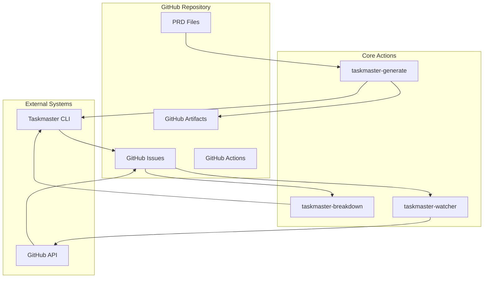

## Core Components

### 1. GitHub Actions

#### taskmaster-generate
**Purpose**: Generate GitHub issues from PRD files
**Triggers**: Push events to PRD files
**Key Features**:
- Parses PRD files using Taskmaster CLI
- Creates hierarchical GitHub issues with dependencies
- Uploads task graph artifacts with structured metadata
- Configurable complexity thresholds and recursion depth

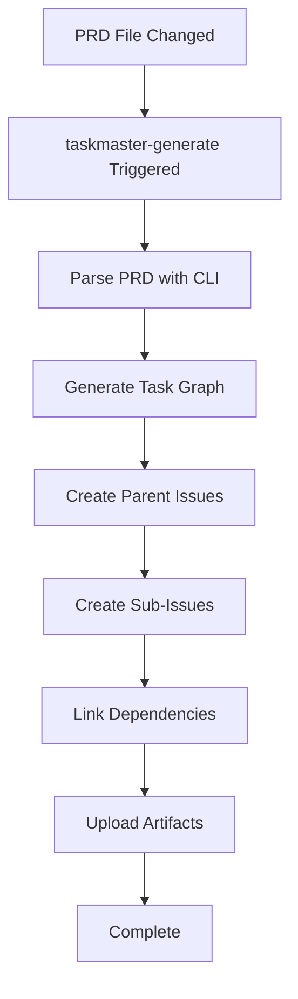

#### taskmaster-breakdown
**Purpose**: Break down large issues into manageable sub-tasks
**Triggers**: Issue comments with `/breakdown` command
**Key Features**:
- On-demand decomposition of existing issues
- Configurable depth and complexity thresholds
- Maintains parent-child relationships

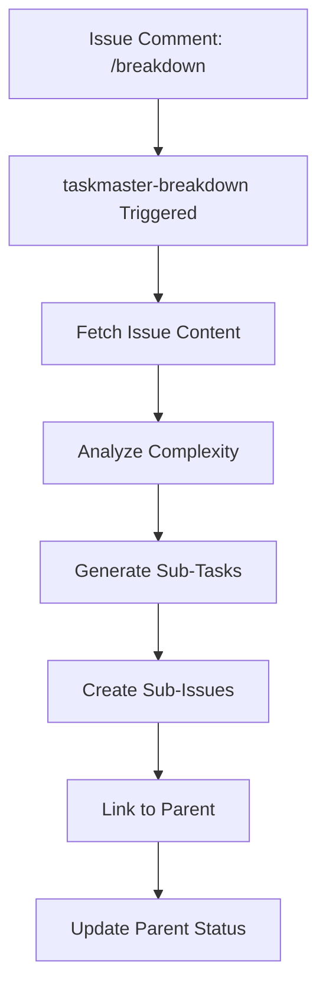

#### taskmaster-watcher
**Purpose**: Monitor dependencies and update issue status
**Triggers**: Issue closed events and scheduled cron jobs
**Key Features**:
- Automatic dependency resolution
- Status label management (blocked/ready)
- Dual-mode operation (webhook + scheduled)

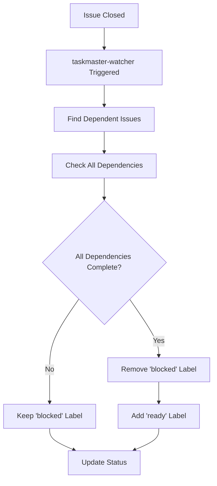

### 2. API Integration Layer

#### Enhanced GitHub API Client
**Location**: `scripts/github-api.ts`
**Purpose**: Robust GitHub API integration with enhanced error handling

**Key Features**:
- Rate limiting and retry logic
- Circuit breaker pattern for failure protection
- Priority-based operation queuing
- Comprehensive error categorization
- Batch operation support with controlled concurrency

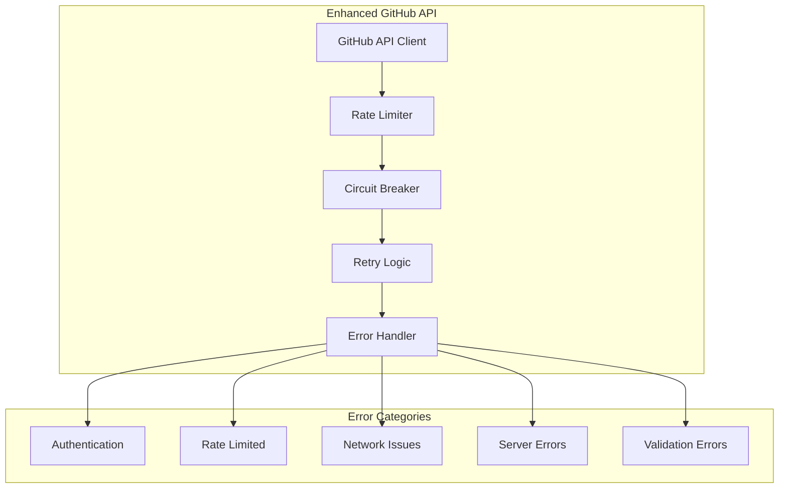

#### Sub-Issues API
**Location**: `scripts/github-api.ts` (sub-issue methods)
**Purpose**: Manage hierarchical issue relationships

**Core Operations**:
- Parse sub-issue references from issue bodies
- Create parent-child relationships
- Update issue bodies with relationship metadata
- Remove relationships when needed

### 3. Configuration Management

#### Configuration Sources
1. **Environment Variables**: Runtime configuration
2. **Configuration Files**: Repository-specific settings
3. **GitHub Secrets**: Sensitive data (tokens, credentials)

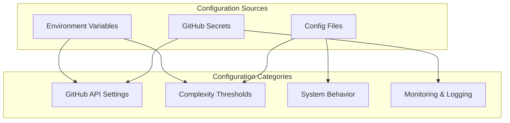

### 4. Error Handling and Recovery

#### Multi-Layer Error Handling
1. **Application Layer**: Business logic error handling
2. **API Layer**: GitHub API error recovery
3. **Infrastructure Layer**: GitHub Actions retry mechanisms

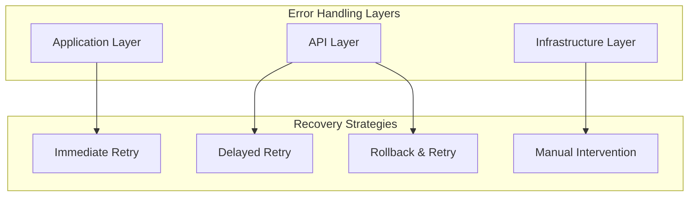

#### Error Recovery Workflows
- **Transient Errors**: Automatic retry with exponential backoff
- **Rate Limiting**: Priority queue with intelligent scheduling
- **Authentication**: Circuit breaker with manual intervention triggers
- **Data Validation**: Rollback and retry with enhanced validation

### 5. Data Flow Architecture

#### PRD to Issues Flow
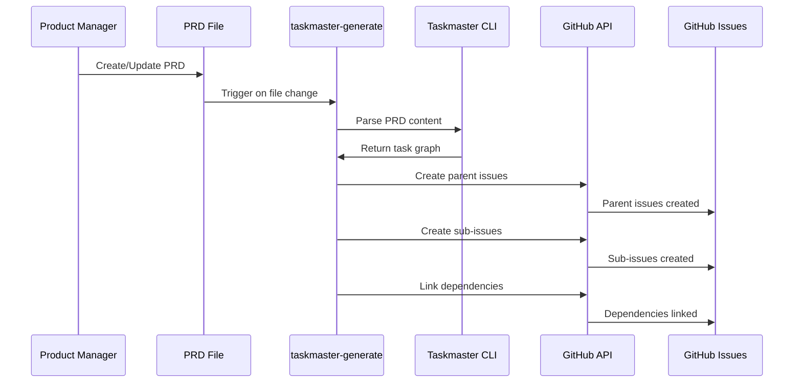

#### Issue Lifecycle Flow
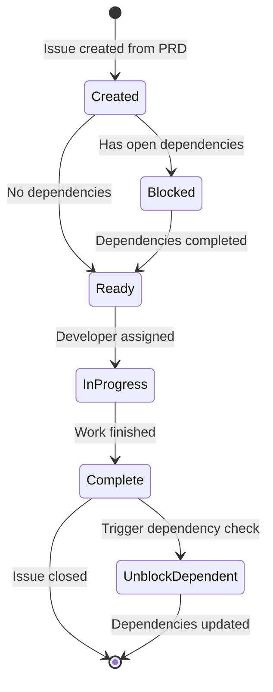

#### Dependency Resolution Flow
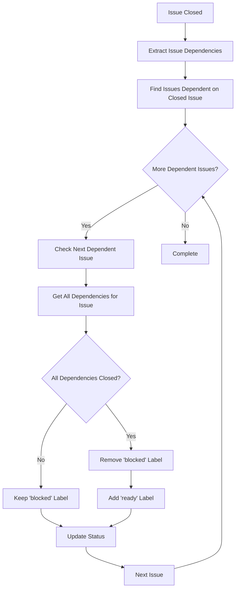

## Data Models

### Issue Structure

```typescript
interface TaskmasterIssue {
  // GitHub Issue Fields
  number: number;
  title: string;
  body: string;
  state: 'open' | 'closed';
  labels: string[];
  
  // Taskmaster Extensions
  taskId: string;
  parentTaskId?: string;
  dependencies: number[];
  complexity: number;
  estimatedHours: number;
  
  // Metadata
  createdFromPRD: string;
  generationTimestamp: string;
}
```

### Task Graph Artifact

```typescript
interface TaskGraphArtifact {
  metadata: {
    prd_version: string;
    generation_timestamp: string;
    complexity_threshold: number;
    max_depth: number;
    total_tasks: number;
    leaf_tasks_count: number;
    task_hierarchy_depth: number;
  };
  
  tasks: Task[];
  dependencies: DependencyMap;
  issues: IssueMapping;
}
```

### Configuration Schema

```typescript
interface TaskmasterConfig {
  // Core Settings
  complexity_threshold: number;
  max_depth: number;
  dry_run: boolean;
  
  // GitHub Settings
  github: {
    token: string;
    owner: string;
    repo: string;
    rate_limit_buffer: number;
  };
  
  // Behavior Settings
  concurrency: number;
  retry_max_attempts: number;
  retry_delay_ms: number;
  
  // Artifact Settings
  artifacts: {
    retention_days: number;
    max_size_mb: number;
  };
}
```

## Integration Points

### 1. GitHub API Integration

**Authentication**: GitHub Personal Access Token
**Permissions Required**:
- Repository read/write access
- Issues read/write access
- Actions read/write access (for artifacts)

**Rate Limiting Strategy**:
- Monitor rate limit headers
- Implement exponential backoff
- Use priority queuing for critical operations
- Reserve buffer for emergency operations

### 2. Taskmaster CLI Integration

**Binary Management**: 
- Download appropriate platform binary
- Verify checksums for security
- Cache binaries for performance

**Execution Interface**:
- Parse PRD files to task graphs
- Handle CLI errors and edge cases
- Capture structured output for processing

### 3. GitHub Actions Integration

**Workflow Triggers**:
- Push events to PRD files
- Issue comment events for `/breakdown`
- Issue close events for dependency updates
- Scheduled cron for health checks

**Environment Management**:
- Secure secret handling
- Environment variable propagation
- Artifact upload/download

## Security Considerations

### 1. Authentication & Authorization

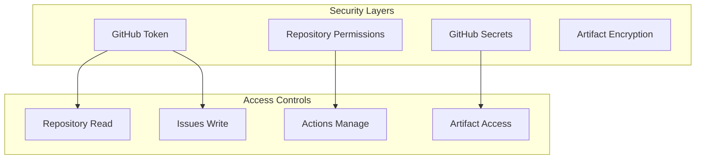

### 2. Data Protection

- **Secrets Management**: Sensitive data stored in GitHub Secrets
- **Artifact Encryption**: Task graph data encrypted at rest
- **Token Scope**: Minimal required permissions for GitHub tokens
- **Audit Logging**: Comprehensive logging of all operations

### 3. Input Validation

- **PRD Content**: Validate PRD file structure and content
- **Issue Comments**: Sanitize and validate command inputs
- **Configuration**: Validate all configuration parameters
- **API Responses**: Validate GitHub API response structure

## Performance Characteristics

### 1. Scalability Metrics

| Metric | Target | Notes |
|--------|--------|-------|
| Action Runtime | <5 minutes | 95th percentile |
| Issue Creation | <30 seconds | Per issue |
| Dependency Resolution | <15 minutes | Median time |
| API Rate Limit | <80% utilization | Normal operation |

### 2. Resource Usage

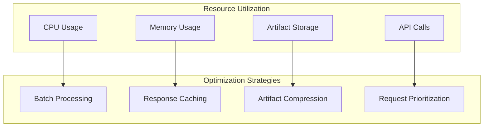

### 3. Performance Optimization

- **Batch Operations**: Group API calls for efficiency
- **Concurrent Processing**: Controlled concurrency limits
- **Intelligent Caching**: Cache frequently accessed data
- **Priority Queuing**: Critical operations get priority

## Monitoring and Observability

### 1. Health Metrics

```typescript
interface SystemHealthMetrics {
  // Performance Metrics
  average_action_runtime: number;
  api_response_times: number[];
  error_rate_percentage: number;
  
  // Resource Metrics  
  api_rate_limit_usage: number;
  artifact_storage_usage: number;
  concurrent_operations: number;
  
  // Business Metrics
  issues_created_per_day: number;
  dependency_resolution_time: number;
  breakdown_success_rate: number;
}
```

### 2. Logging Strategy

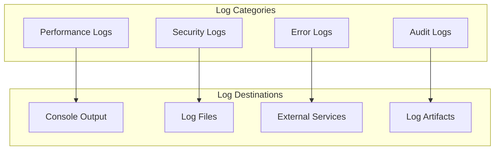

### 3. Alerting

- **Critical Errors**: Authentication failures, system outages
- **Performance Degradation**: Slow response times, high error rates
- **Resource Limits**: Rate limit exhaustion, storage quota
- **Business Metrics**: Issue creation failures, dependency loops

## Deployment Architecture

### 1. GitHub Actions Deployment

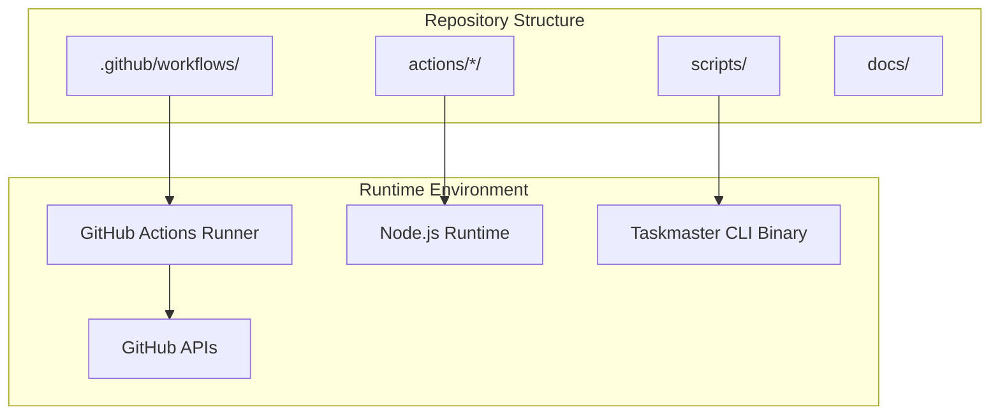

### 2. Environment Configuration

- **Development**: Local testing with test repositories
- **Staging**: Validation environment with full feature set
- **Production**: Live repository with real PRDs and issues

### 3. Release Management

- **Semantic Versioning**: Clear version management for actions
- **Rolling Deployment**: Gradual rollout of new features
- **Rollback Strategy**: Quick revert capability for issues
- **Feature Flags**: Controlled feature activation

## Future Architecture Considerations

### 1. Scalability Enhancements

- **Multi-Repository Support**: Cross-repository task graphs
- **Advanced Analytics**: Machine learning for task estimation
- **Real-time Updates**: WebSocket-based live updates
- **External Integrations**: Jira, Slack, project management tools

### 2. Technical Improvements

- **GraphQL Integration**: More efficient GitHub API usage
- **Caching Layer**: Redis for improved performance
- **Message Queue**: Async processing for large operations
- **Database Storage**: Persistent storage for complex queries

### 3. User Experience

- **Web Dashboard**: Visual interface for task management
- **Mobile Support**: Mobile-optimized issue management
- **AI Assistance**: Smart task breakdown suggestions
- **Collaboration Features**: Team coordination tools

## Related Documentation

- [API Reference](./api-reference.md) - Complete API documentation
- [User Guide](./user-guide.md) - User-facing documentation for all personas
- [Deployment Guide](./deployment-guide.md) - Step-by-step deployment instructions
- [Configuration Management](./configuration-management.md) - Configuration options and examples