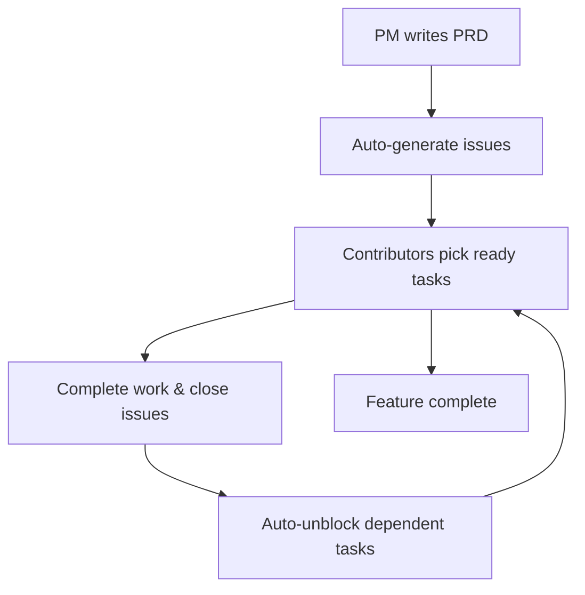
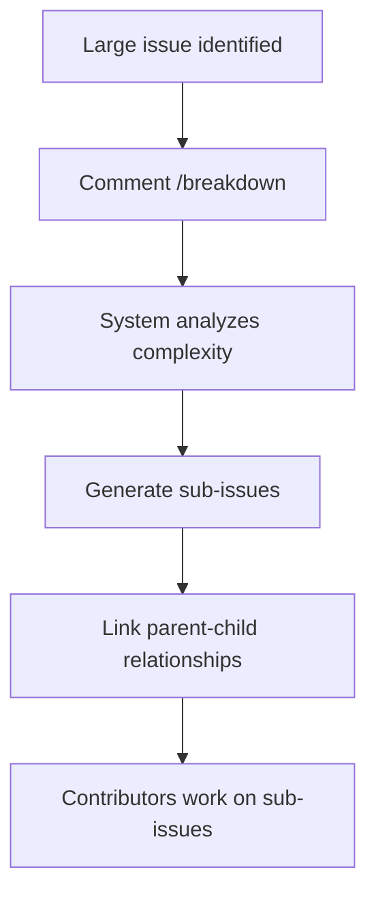
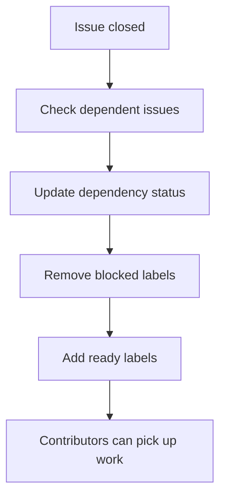

# Task Master Issues User Guide

A comprehensive guide for using the Task Master Issues system across different roles and use cases.

## Quick Start

### For Contributors
1. Browse open issues labeled with `ready`
2. Pick any unblocked issue to work on
3. Use `/breakdown` command if an issue seems too large
4. Close issues when work is complete

### For Maintainers  
1. Create PRD files in `docs/` directory
2. Push changes to trigger automatic issue generation
3. Configure complexity thresholds and recursion depth
4. Monitor system health and performance

### For Project Managers
1. Write Product Requirements Documents (PRDs) 
2. Review generated task hierarchies
3. Adjust complexity thresholds as needed
4. Track progress through GitHub Issues

## User Personas

### 1. Contributors (Developers, Designers, QA)

**Goal**: Find and complete well-scoped work items efficiently

#### Daily Workflow
1. **Find Work**: Browse issues with `ready` label
2. **Verify Scope**: Check issue complexity and description
3. **Request Breakdown**: Comment `/breakdown` if scope is unclear
4. **Complete Work**: Implement feature/fix and close issue
5. **Check Dependencies**: Automatic unblocking of dependent issues

#### Key Features for Contributors
- **Unblocked Issues**: Only see issues that are ready to work on
- **Right-Sized Tasks**: Issues automatically scoped to ≤4 hours
- **On-Demand Breakdown**: Get help breaking down large tasks
- **Dependency Clarity**: Clear view of what blocks/unblocks work

#### Example Workflows

**Finding Work**:
```
1. Go to GitHub Issues
2. Filter by label: "ready" AND "taskmaster"  
3. Pick any issue - they're all unblocked and right-sized
4. Self-assign and start working
```

**Requesting Breakdown**:
```
1. Open an issue that seems too large
2. Comment: "/breakdown"
3. Wait 1-2 minutes for sub-issues to be created
4. Work on the smaller sub-issues instead
```

### 2. Maintainers (Tech Leads, Senior Engineers)

**Goal**: Configure and maintain the task generation system

#### Setup Workflow
1. **Configure Repository**: Set up GitHub Actions workflows
2. **Set Thresholds**: Configure complexity and depth settings
3. **Create PRDs**: Write initial Product Requirements Documents
4. **Monitor Health**: Check system performance and error rates

#### Key Features for Maintainers
- **Configurable Complexity**: Adjust task sizing thresholds
- **Recursion Control**: Set maximum breakdown depth
- **Error Recovery**: Automatic retry and fallback mechanisms
- **Performance Monitoring**: Built-in metrics and reporting

#### Configuration Management

**Complexity Thresholds**:
```yaml
# .taskmaster/config.yml
complexity_threshold: 4  # Tasks > 4 hours get broken down
max_depth: 3            # Maximum breakdown levels
```

**GitHub Actions Configuration**:
```yaml
# .github/workflows/taskmaster.yml
on:
  push:
    paths: ['docs/*.prd.md']  # Trigger on PRD changes
  issue_comment:
    types: [created]          # Handle /breakdown commands
  issues:
    types: [closed]           # Update dependencies
```

#### Monitoring and Maintenance

**Health Checks**:
- Monitor action execution times (target: <5 minutes)
- Check error rates in system logs
- Review artifact upload success rates
- Validate issue creation accuracy

**Performance Tuning**:
- Adjust concurrency limits for GitHub API calls
- Configure retry strategies for different error types
- Optimize batch processing for large PRDs

### 3. Product Managers (PMs, Product Owners)

**Goal**: Plan features and track progress through structured task breakdown

#### Planning Workflow  
1. **Write PRDs**: Create detailed Product Requirements Documents
2. **Review Generated Tasks**: Validate automatic task breakdown
3. **Adjust Scope**: Modify PRDs to refine task generation
4. **Track Progress**: Monitor completion through GitHub Issues

#### Key Features for Product Managers
- **Automated Breakdown**: PRDs automatically become task hierarchies
- **Living Documentation**: PRD changes sync to issues automatically  
- **Progress Tracking**: Visual progress through GitHub Issues
- **Scope Validation**: Automatic flagging of oversized tasks

#### PRD Writing Guidelines

**Structure Template**:
```markdown
# Feature Name
**Doc version**: v1.0
**Status**: Draft

## Purpose & Goals
[Clear objectives and success metrics]

## Scope
[What's included and excluded]

## User Stories  
1. As a [user], I want [goal] so that [benefit]
2. [Additional stories...]

## Technical Requirements
[Implementation details and constraints]

## Acceptance Criteria
[Definition of done for each component]
```

**Best Practices**:
- Write clear, actionable user stories
- Include measurable success criteria
- Break complex features into logical components
- Specify technical constraints and dependencies

#### Progress Tracking

**GitHub Issues Integration**:
- Each PRD section becomes a parent issue
- Complex tasks automatically broken into sub-issues  
- Dependencies tracked and visualized
- Completion status updated automatically

**Metrics and Reporting**:
- Task completion velocity
- Scope accuracy (% of tasks ≤4 hours)
- Dependency resolution time
- Feature delivery timeline

### 4. System Operators (DevOps, SRE)

**Goal**: Deploy, monitor, and maintain the Task Master Issues system

#### Deployment Workflow
1. **Repository Setup**: Configure GitHub repository and permissions
2. **Secrets Management**: Set up GitHub tokens and environment variables
3. **Workflow Configuration**: Deploy and configure GitHub Actions
4. **Monitoring Setup**: Configure alerting and log aggregation

#### Key Features for Operators
- **Automated Deployment**: GitHub Actions handle execution
- **Error Recovery**: Built-in retry and fallback mechanisms
- **Resource Management**: Controlled concurrency and rate limiting
- **Observability**: Comprehensive logging and metrics

#### Deployment Guide

**Prerequisites**:
- GitHub repository with Actions enabled
- GitHub token with repository permissions
- Node.js environment for local testing

**Installation Steps**:
```bash
# 1. Clone repository
git clone <repository-url>
cd task-master-issues

# 2. Install dependencies  
npm install

# 3. Configure environment
cp .env.example .env
# Edit .env with your GitHub token and repository info

# 4. Test configuration
npm run lint
npm run test:all

# 5. Deploy GitHub Actions
git push origin main
```

**GitHub Secrets Configuration**:
```
GITHUB_TOKEN: Personal access token with repo permissions
TASKMASTER_CONFIG: JSON configuration object (optional)
```

#### Monitoring and Operations

**Key Metrics**:
- Action execution time (target: <5 minutes)
- API rate limit utilization
- Error rate by category
- Artifact storage usage

**Log Monitoring**:
```typescript
// Example log patterns to monitor
"Rate limit exceeded"     // Rate limiting issues
"Circuit breaker open"    // System protection activated  
"Artifact upload failed"  // Storage issues
"Authentication failed"   // Token/permission issues
```

**Troubleshooting Common Issues**:

1. **Rate Limiting**: 
   - Check GitHub API usage
   - Adjust concurrency settings
   - Verify token permissions

2. **Authentication Failures**:
   - Validate GitHub token
   - Check repository permissions
   - Verify secret configuration

3. **Performance Issues**:
   - Monitor action execution times
   - Check artifact storage usage
   - Review batch processing settings

#### Backup and Recovery

**Artifact Management**:
- Task graphs stored as GitHub Artifacts
- Automatic cleanup based on retention policies
- Manual recovery through artifact download

**State Recovery**:
- Idempotency ensures safe re-execution
- Failed operations automatically retried
- Manual replay through artifact system

## Common Workflows

### 1. Feature Development Cycle



### 2. Issue Breakdown Process



### 3. Dependency Resolution



## Configuration Reference

### Environment Variables

```bash
# Required
GITHUB_TOKEN=ghp_xxxxxxxxxxxx           # GitHub personal access token
GITHUB_OWNER=your-org                   # Repository owner
GITHUB_REPO=your-repo                   # Repository name

# Optional
TASKMASTER_COMPLEXITY_THRESHOLD=4       # Hours threshold for breakdown
TASKMASTER_MAX_DEPTH=3                  # Maximum breakdown depth
TASKMASTER_DRY_RUN=false               # Enable dry-run mode
TASKMASTER_CONCURRENCY=3               # API concurrency limit
```

### Configuration File (.taskmaster/config.yml)

```yaml
# Task generation settings
complexity_threshold: 4      # Break down tasks > 4 hours
max_depth: 3                # Maximum breakdown levels
dry_run: false              # Set true to preview without creating issues

# GitHub API settings  
github:
  rate_limit_buffer: 100    # API calls to reserve
  retry_max_attempts: 5     # Maximum retry attempts
  retry_delay_ms: 1000     # Base retry delay

# Artifact settings
artifacts:
  retention_days: 30        # How long to keep artifacts
  max_size_mb: 10          # Maximum artifact size
```

## Best Practices

### For All Users
1. **Keep PRDs Updated**: Treat PRDs as living documents
2. **Use Labels Effectively**: Leverage GitHub labels for filtering
3. **Monitor Dependencies**: Understand task relationships
4. **Provide Feedback**: Report issues and suggest improvements

### For Contributors
1. **Check Issue Scope**: Verify tasks are appropriately sized
2. **Use Breakdown Feature**: Don't hesitate to request breakdown
3. **Update Progress**: Keep issue comments updated
4. **Close Promptly**: Close issues when work is complete

### For Maintainers
1. **Monitor Performance**: Keep action times under 5 minutes
2. **Tune Thresholds**: Adjust complexity based on team velocity
3. **Review Error Logs**: Address recurring issues promptly
4. **Update Documentation**: Keep guides current with changes

### For Product Managers
1. **Write Clear PRDs**: Use specific, actionable language
2. **Include Success Metrics**: Define measurable outcomes
3. **Review Generated Tasks**: Validate automatic breakdown
4. **Iterate Based on Feedback**: Refine PRDs based on execution

## Troubleshooting

### Common Issues

**"No ready issues to work on"**
- Check if parent dependencies are complete
- Verify issue labels are correctly set
- Look for issues in "blocked" state

**"/breakdown command not working"**  
- Ensure proper syntax: exact text "/breakdown"
- Check if GitHub Actions are enabled
- Verify bot has repository permissions

**"Issues not syncing with PRD changes"**
- Confirm GitHub Actions are triggering
- Check action execution logs
- Verify file paths match trigger patterns

**"System seems slow"**
- Monitor GitHub API rate limits
- Check action execution times
- Review error logs for retries

### Getting Help

1. **Check Documentation**: Review relevant guides and API reference
2. **Search Issues**: Look for similar problems in repository issues
3. **Enable Debug Logging**: Set `TASKMASTER_DEBUG=true` for detailed logs
4. **Contact Maintainers**: Create issue with system info and error details

## Related Resources

- [API Reference](./api-reference.md) - Complete API documentation
- [Architecture Overview](./architecture-overview.md) - System design and components
- [Deployment Guide](./deployment-guide.md) - Step-by-step deployment instructions
- [Configuration Reference](./configuration-management.md) - All configuration options